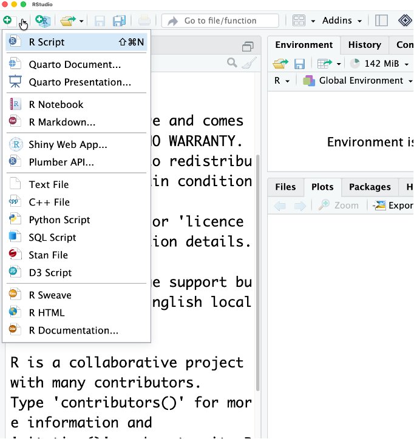
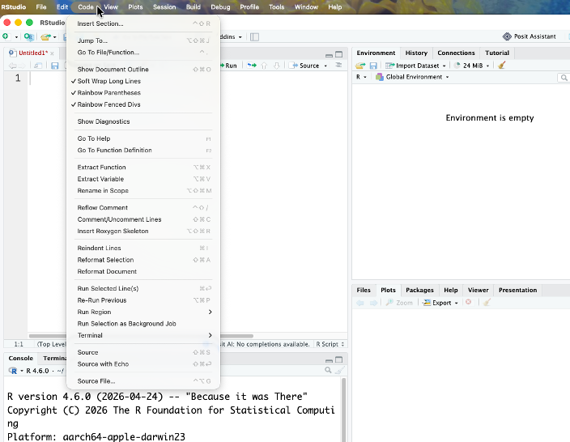
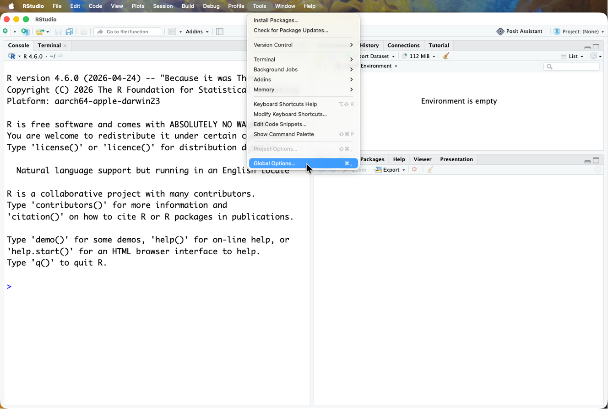
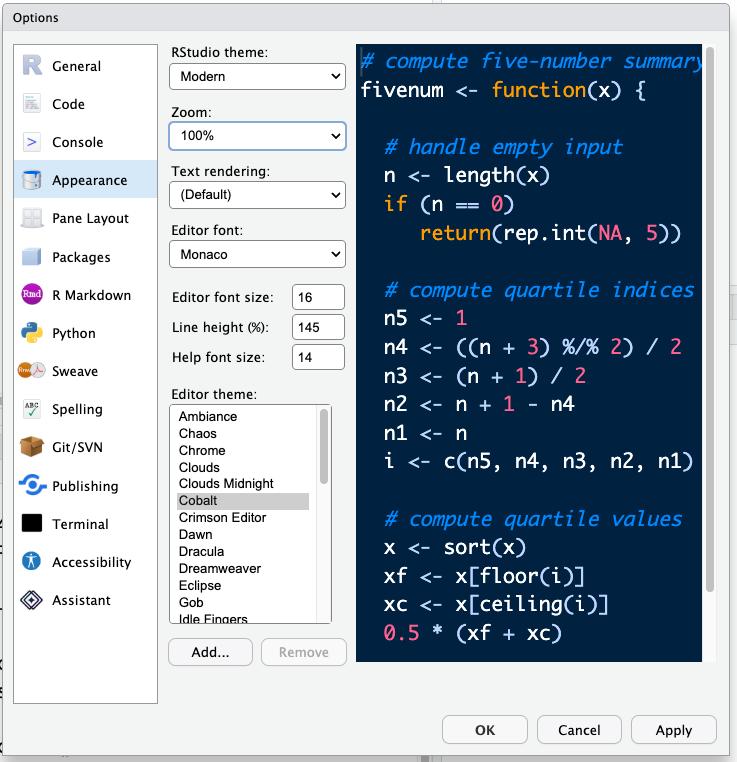

  
# Introducing RStudio Server

In these lessons, we will be making use of a software called
[RStudio](https://posit.co/downloads), an [Integrated
Development Environment
(IDE)](https://en.wikipedia.org/wiki/Integrated_development_environment).
RStudio, like most IDEs, provides a graphical interface to R, making it
more user-friendly, and providing dozens of useful features. We will
introduce additional benefits of using RStudio as you cover the lessons.
In this case, we are specifically using [RStudio
Server](https://www.rstudio.com/products/RStudio/#Server), a version of
RStudio that can be accessed in your web browser. RStudio Server has the
same features of the Desktop version of RStudio you could download as
standalone software.

{width="100%"}

## Overview and customisation of the RStudio layout

The first thing you'll want to do is open a new R script to write all your code in. Click the new script button in the top left corner:

\

Here are the major windows (or panes) of the RStudio environment:

-  **Source**: This pane is where you will write/view R scripts. Some
        outputs (such as if you view a dataset using `View()`) will appear
        as a tab here. 

-  **Console/Terminal/Jobs**: This is actually where you see the
        execution of commands. This is the same display you would see if you
        were using R at the command line without RStudio. You can work
        interactively (*i.e.,* enter R commands here), but for the most part we
        will run a script (or lines in a script) in the source pane and
        watch their execution and output here. The "Terminal" tab give you
        access to the BASH terminal (the Linux operating system, unrelated
        to R). RStudio also allows you to run jobs (analyses) in the
        background. This is useful if some analysis will take a while to
        run. You can see the status of those jobs in the background.  

-  **Environment/History**: Here, RStudio will show you what datasets
        and objects (variables) you have created and which are defined in
        memory. You can also see some properties of objects/datasets such as
        their type and dimensions. The "History" tab contains a history of
        the R commands you've executed R.  

-   **Files/Plots/Packages/Help/Viewer**: This multi-purpose pane will
        show you the contents of directories on your computer. You can also
        use the "Files" tab to navigate and set the working directory. The
        "Plots" tab will show the output of any plots generated. In
        "Packages" you will see what packages are actively loaded, or you
        can attach installed packages. "Help" will display help files for R
        functions and packages. "Viewer" will allow you to view local web
        content (*e.g.,* HTML outputs). In the "Files" tab you can select a file and download it from your
    cloud instance (click the "more" button) to your local computer.
    Uploads are also possible.

All of the panes in RStudio have configuration options. For example, you
can minimise/maximise a pane, or by moving your mouse in the space
between panes you can resize as needed. The most important customisation
options for pane layout are in the `View`
menu. Other options such as font sizes, colors/themes, and more are in
the `Tools` menu under `Global
Options`.

## Code and Global options

These are a few suggestion we have for improving your viewing and coding experience

- Under <KBD>Code</KBD> enable 'Rainbow Parentheses' and 'Soft Wrap Long Lines'

- Got to <KBD>Tools</KBD> -> <KBD>Global options</KBD> 

- Under <KBD>Appearance</KBD> change the editor font size to larger (or smaller, whatever you prefer) and change the theme if you like different colours. The default editor theme is Textmate. Don't forget to hit <KBD>Apply</KBD>!

    

## RStudio contextual help

Here is one last bonus we will mention about RStudio. It's difficult to
remember all of the arguments and definitions associated with a given
function. When you start typing the name of a function and hit the
<kbd>Tab</kbd> key, RStudio will display functions and
associated help:

Once you type a function, hitting the <kbd>Tab</kbd> inside the parentheses will
show you the function's arguments and provide additional help for each of these 
arguments.

