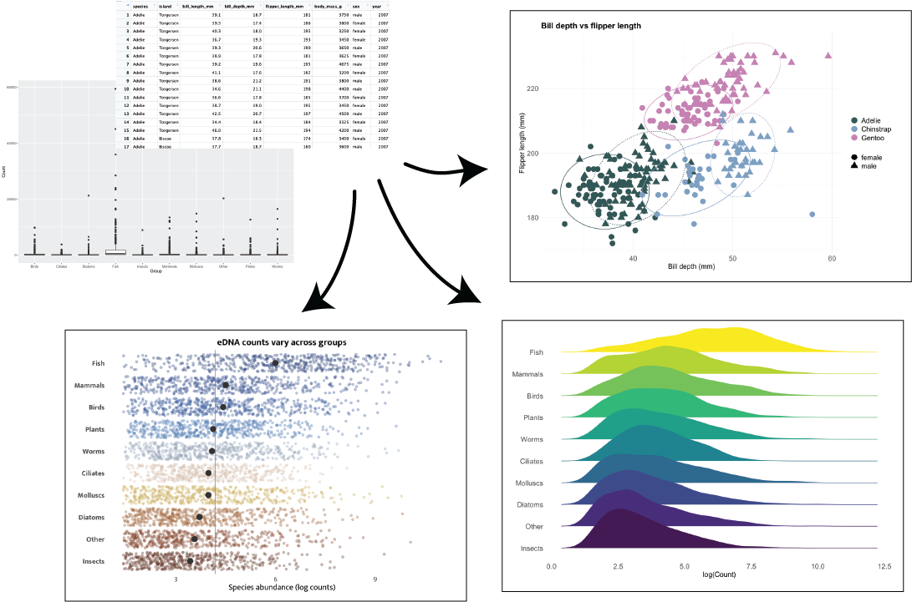

# From Start to Finish: Visualising Your Data

\

\

Good visualisation is about more than just writing the correct code. Visualisation is communication, and good communication requires thinking about how we as the scientist/data analyst/creator convey our message to the reader. This one-day workshop will provide you with a toolbox of skills and code examples to help you create clear, visually interesting visualisations which accurately communicate a message. 

### What's covered in this workshop

- The basic code template for `ggplot2`.  
- Types of data visualisations and their impact on how we interpret the data.    
- Examples of good visualisations from the community (with code).  
- Evolving a plot from a simple boxplot, building up new geom layers and refining the visualisation.    

### What's not covered in this workshop

- Performing statistical analysis on data.  
- Interactive or animated plotting.  
- Extensive data manipulation and wrangling.  

### Why are we doing this? 

Because some plots look like [this](https://docs.google.com/presentation/d/1PyuGRbqPpjMoswuTMbgOqHfe6Uc-wji7uEJkxyxI9Jw/edit#slide=id.p) (Credit to Dr. Joseph Guhlin for this presentation).

### Attribution  

This workshop was created by [Tyler McInnes](https://github.com/tylermcinnes), while he was a [Bioinformatics Training Coordinator at Genomics Aotearoa](https://genomicsaotearoa.github.io/BioinformaticsTrainingProgramme/meetTheTeam.html#past-team-members), and has been developed further by [Chloé van der Burg](https://genomicsaotearoa.github.io/BioinformaticsTrainingProgramme/meetTheTeam.html#get-to-know-the-team).

::: {style="background: #FFFFFF; text-align:center; padding: 1.5rem; border-radius: 8px; max-width: 800px; margin: 0 auto;"}

### {style="background: #eaf1fb; text-align:center;"}

[{width=80%}](https://genomicsaotearoa.github.io/BioinformaticsTrainingProgramme/)

Made with [❤️](https://docs.carpentries.org/policies/coc/) and [Quarto](https://genomicsaotearoa.github.io/reproducibility_with_git_and_quarto/quarto_overview.html)

:::
