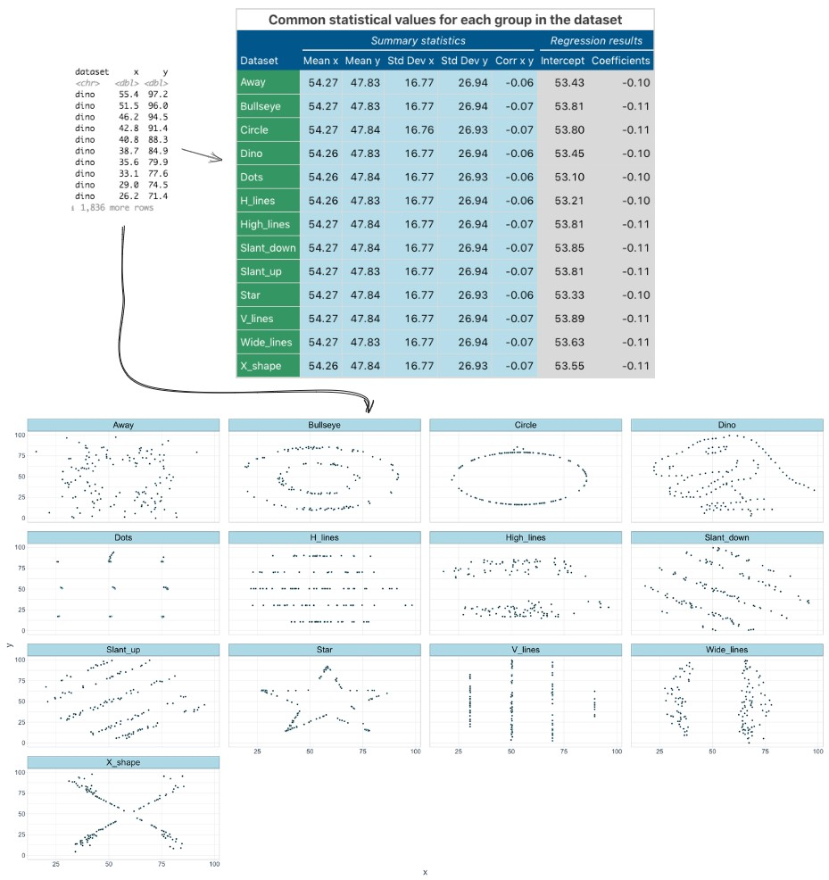
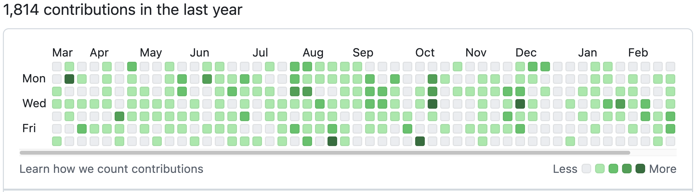
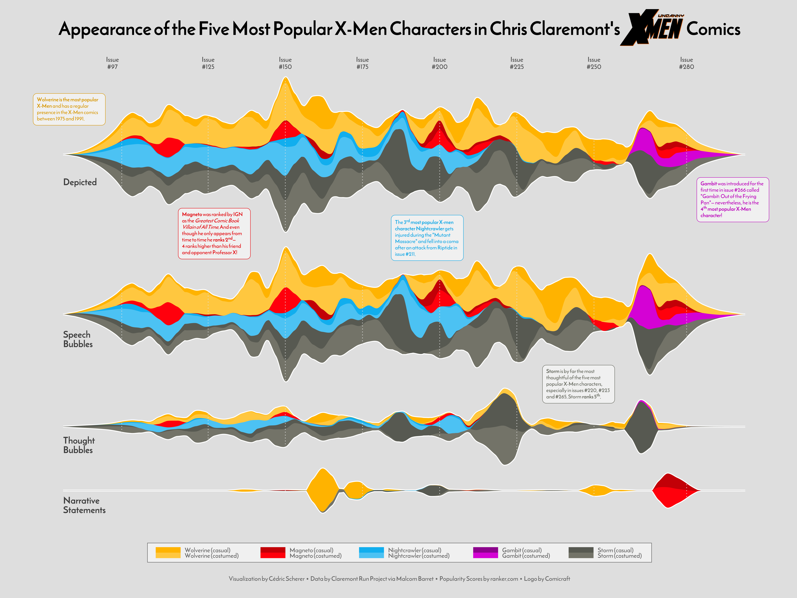

# Visualisation for ourselves - Exploratory Analysis

Visualisation is most often thought of as something we do for other people, to share some piece of knowledge we have. But equally important is the role visualisation can play in us learning something about our data. Visualisation can reveal trends or associations that we would otherwise struggle to identify in observations stored in rows and columns. 

In this section we will perform some quick data visualisations that we can use for our own observations. The output of this section does not need to be overly attractive, but it does need to be clear and should 'standalone' (*i.e.,* should speak for itself, without the need of accompanying notes).

The aims for this section are to give you the opportunity to practice some of the most important code used in visualisations and to force you to think about visualisation: what types of figures work well for certain data, how to display the information you want to convey. 

We will examine one type of graph to represent four different types of data: **distribution**, **correlation**, **parts of a whole**, and **evolution (change over time)**. 

## Distribution

Distribution plots are a good place to start any data analysis, because many statistical tests rely on the assumption of a normal distribution. We may also make our own assumptions about how data is similar or different between different groups. The classic argument for distribution plots is the "[datasaurus dozen](https://en.wikipedia.org/wiki/Datasaurus_dozen#/media/File:EDA_example_-_Always_plot_your_data.jpg)" - a set of 13 datasets with identical summary statistics (same mean of x, mean of y, Std Dev *etc.,*) but when plotted reveal funny patterns (including points in the shape of a dinosaur). 

Distribution matters! 



### Beeswarm plots with ggbeeswarm

Here we will use a type of plot, called a beeswarm plot, to highlight the power of visualisation.

Beeswarm plots can be made using a standalone package (`install.packages("beeswarm")`) or using a package that extends ggplot2 (`install.packages("ggbeeswarm")`). We will use the latter, since it lets us work within the ggplot format we have looked at already. 

Install the ggbeeswarm package, then load the ggbeeswarm and palmerpenguins packages. We will also use tidyverse later. 
(we have commented it out here to prevent this server re-installing the package)

```{r}
#| eval: false
#install.packages("ggbeeswarm")
```

```{r}
#| message: false

library(ggbeeswarm)
library(palmerpenguins)
library(tidyverse) 
```

### Beeswarm plots

Like with the `geom_boxplot()` we looked at in the previous episode, we need to specify where the data comes from and how the data is mapped. Beeswarm plots are simple and we will initially only need to specify the x and y axis data. 

```{r}
#| warning: false
ggplot(data = penguins,
        mapping = aes(x = species,
                      y = flipper_length_mm)) +
  geom_beeswarm()
```
**Note:** *When running this code, ggplot gives us a warning that rows were removed due to missing values. This workshop material has a hidden line of code to suppress these warnings.*

With this plain plot we can see what beeswarm is doing - when points on the y axis share a value they are moved horizontally so that overlapping points can be identified. This concept is commonly referred to as "jitter", and "jitter plots" are a class of chart. Beeswarm plots are an implementation of jitter plots that aim to be compact with as little as possible overlap of points. This gives us the ability to see density through the width of the plot, similar to how a violin plot (geom_violin) works. 

Distribution plots are a good opportunity to introduce two new parameters we can adjust in ggplot: size and alpha. 

- **Size** is simply the size of the data point. We can assign a single value for all points, or can assign a continuous variable. 

- **Alpha** is the level of transparency. When data points are too large (from the size argument), or too numerous, the points can overlap one another (a problem called "overplotting"). This is particularly problematic outside of beeswarm. When we set alpha to something less than 1, the points become somewhat transparent. Therefore, if two points overlap one another, it is clear from the change in colour (as two transparent but overlapping points are darker than a single point). 

```{r}
#| warning: false
ggplot(data = penguins,
        mapping = aes(x = species,
                      y = flipper_length_mm,
                      colour = species)) +
  geom_beeswarm(size = 2, alpha = 0.7)
```

(Here, one could argue that increasing the size and decreasing the alpha has *decreased* the quality of our plot, but it's just for the purpose of demonstration).


### Jittering the points with geom_jitter()

A commonly used function for jittering is `geom_jitter()`, which adds a small amount of random variation to each point to reduce overplotting. 


##### EXERCISE 🧠🏋️‍♀️ (3 mins)

Using the code above, change the geom to geom_jitter() and compare the outputs. Which one do you prefer and which one better represents the distribution of the data?

::: {.callout-tip collapse="true"}
# Solution

```{r}
#| warning: false

ggplot(data = penguins, 
       mapping = aes(x = species, 
                     y = flipper_length_mm,
                     colour = species)) +
  geom_jitter(size = 2, 
                   alpha = 0.7)
```


Looks like we have lost a lot of the distribution information here, that we could see more clearly in the beeswarm plot. This is a good example of how the wrong choice of plot can lead to a misleading visualisation.

While useful for showing individual observations, jitter does not meaningfully represent distribution shape and can sometimes obscure density patterns. For visualising distributions, approaches such as beeswarm, violin, or boxplots are often more appropriate.

:::


#### Theme and labels
We can add two other functions to make this plot much easier to read. First, the `theme_minimal()` function is a quick way to set a global theme to the plot and make it less cluttered. The second function is `labs()`, which we use to add a title, subtitle, caption and x and y axes labels. We will cover themes more later, but adding `theme_minimal()` to every plot we do today will keep them looking tidy and coherent.

```{r}
#| warning: false

ggplot(data = penguins, 
        mapping = aes(x = species,
                      y = flipper_length_mm,
                      color = species)) +
  geom_beeswarm() +
  theme_minimal() +
  labs(title = "Flipper Length Distribution by Species",
      subtitle = "Source: Penguins dataset from the palmerpenguins package",
       x = "Species",
       y = "Flipper Length (mm)")
```

## Correlation

### Heatmaps with geom_tile()

Heatmaps can be used to visualise values across two dimensions using colour. In a biological context this could be gene expression values across a range of genes for a set of samples. This is often combined with some type of clustering (*e.g.,* unsupervised hierarchical clustering with k-means) to identify patterns of gene expression which differ between sample groups. 

Here we will use `geom_tile()` to create a particular type of heatmap called a "calendar heatmap", which will display a value on a given day for a selected time period. The example below is captured from github, which display the number of commits (saves) a user made across the year.



That's a lot of commits! 

#### Choose your own adventure 👣:

::: {.callout-note collapse="true" appearance="simple"}
# 1. Calendar heatmap example 

#### Calendar heatmap

We will create a simple calendar heatmap to demonstrate the concept. Remember, the goal here is to expose you to different types of plots and for you to practice using ggplot2.

##### Generating example data
First, we will generate some example data. Copy and paste this code, because it is not central to our understanding:
```{r}
set.seed(0982)
month_data <- tibble(
  date = seq(as.Date("2024-12-01"), 
              as.Date("2024-12-31"), 
              by = "day"),
  count = sample(1:20, 31, replace = TRUE)  # Random counts per day
) |>
  mutate(
    weekday = wday(date, label = TRUE, abbr = TRUE),  # Day of the week (Sun-Sat)
    week = (day(date) - 1) %/% 7 + 1  # Week number (1 to 5)
  )

month_data |> head()  
```

##### geom_tile()

Now we will create the plot with `geom_tile()`. Like with the `geom_boxplot()` we looked at in the previous episode, we need to specify where the data comes from and how the data is mapped. With `geom_tile()` we will always need to use `aes()` to specify the x and y, and we will also specify the variable that is used to determine the colour of each tile, which we do with "fill = ". In our example we will map the count variable to fill. 
```{r}
ggplot(data = month_data,
       mapping = aes(x = week, 
                      y = weekday, 
                      fill = count)) +
  geom_tile()
```

This is a good starting point in that we have functionally sketched the data into the plot type. However, we can see that it the layout does not match our expectations for a calendar: it reads the days in reverse (Saturday, Friday, Thursday *etc.,*), and has the week on the x axis. It is also missing a title, and axes labels, and it doesn't have particularly high contrast between high and low values. 

To correct these issues we will: 

- Swap the x and y axis with the `aes()` function.

- Use the `scale_y_reverse()` function to reverse the Y-axis (which will now be weeks) so that the last value (week 5) is placed at the bottom.  

- Add the `scale_fill_viridis_c()` function to change the colour of the fill. The "scale_[argument]_viridis" set of functions are used to select a colour blind-friendly pallette with high contrast. 

- Use the `labs()` function to add title, x and y axis labels, and rename the fill (legend) variable.

- Additionally, we will add colour = "white" as an argument for `geom_tile()`, which will result in a fine white grid separating our tiles, and add the `theme_minimal()` function to reduce the visual clutter of the grey background in the plot.

##### Exercise: Use the code block and tips above to create an improved version of the calendar heatmap.

You do not need to do all of these changes, but try them out if you can! Remember to add a "+" at the end of each line when adding new functions. 

::: {.callout-tip collapse="true"}
## Solution

```{r}
ggplot(data = month_data,
       mapping = aes(x = weekday, 
                      y = week, 
                      fill = count)) +
  geom_tile(colour = "white") +
  scale_fill_viridis_c() +
  scale_y_reverse() +
  theme_minimal() +
  labs(title = "December 2024 Calendar Heatmap", 
        x = "Week", 
        y = "Day of the Week", 
        fill = "Count")
```

:::

:::

::: {.callout-note collapse="true" appearance="simple"}
# 2. Gene expression heatmap example 

#### Gene expression heatmap

We will create a simple gene expression heatmap to demonstrate the concept. 

##### Generating example data

First, we will generate some example data. Copy and paste this code, because it is not central to our understanding:

```{r}
set.seed(982)

# 20 genes across 6 samples
expression_data <- expand_grid(
  gene = paste0("Gene_", 1:20),
  sample = paste0("Sample_", 1:6)
) |>
  mutate(
    expression = rnorm(n(), mean = 10, sd = 2)
  )

expression_data |> head()
```

**Note:** This format the data is in is called "long format", which is the format that ggplot2 is designed to work with. If you have data in "wide format" (where each sample is a column), you can use the `pivot_longer()` function from the tidyverse to convert it to long format. [Long vs wide data blog post.](https://www.statology.org/long-vs-wide-data/)

##### geom_tile()

Now we will create the plot with `geom_tile()`. Like with the `geom_boxplot()` we looked at in the previous episode, we need to specify where the data comes from and how the data is mapped. With `geom_tile()` we will always need to use `aes()` to specify the x and y, and we will also specify the variable that is used to determine the colour of each tile, which we do with "fill = ". In our example we will map the count variable to fill. 

```{r}
ggplot(expression_data,
       aes(x = sample,
           y = gene,
           fill = expression)) +
  geom_tile()
```

This is a good starting point in that we have functionally sketched the data into the plot type. However, we can see that it the layout does not match our expectations for a gene expression heatmap: it has no title, and axes labels, and it doesn't have particularly high contrast between high and low values.

##### EXERCISE 🧠🏋️‍♀️ (5 mins)

To correct these issues we will:   

- Add the `scale_fill_viridis_c()` function to change the colour of the fill.   
- Use the `labs()` function to add title, x and y axis labels, and rename the fill (legend) variable.   
- Additionally, we will add colour = "white" as an argument for `geom_tile()`, which will result in a fine white grid separating our tiles, and add the `theme_minimal()` function to reduce the visual clutter of the grey background in the plot.

::: {.callout-tip collapse="true" appearance="simple"}  
# Solution 

```{r}
ggplot(expression_data,
       aes(x = sample,
           y = gene,
           fill = expression)) +
  geom_tile(colour = "white") +
  scale_fill_viridis_c() + #Alternatively, you could use scale_fill_gradient(low = "blue", high = "red") for a different colour scheme
  theme_minimal() +
  labs(title = "Gene Expression Heatmap",
       x = "Sample",
       y = "Gene",
       fill = "Expression (log2 counts)") 
```
**Note:** gene expression data needs to be transformed (*e.g.,* log2 transformed) before plotting. This is covered in more detail in our [RNA-seq Data Analysis](https://genomicsaotearoa.github.io/BioinformaticsTrainingProgramme/portfolio.html#rna-seq-data-analysis) workshop.


Another way to plot heatmaps for gene expression data is with the `pheatmap` package, which has a lot of built in functionality for clustering and annotation. Specifically it allows you to to easily include a dendrogram to show the results of hierarchical clustering, which is a common way to visualise patterns in gene expression data.

See here [R documentation on pheatmap package](https://www.rdocumentation.org/packages/pheatmap/versions/1.0.13/topics/pheatmap). 

:::


:::

## Parts of a whole

In this section we will take a break from executing code and look at some examples. This is an opportunity to introduce you to the excellent resource that is the [R-graph-gallery](https://r-graph-gallery.com/#LogoMenu). We will scroll down to the "Parts of a whole" section, and walk through how this resource not only shows you different types of plots you can create, but provides you with code and reproducible examples.

You can jump straight to our first example, [the waffle chart, here](https://r-graph-gallery.com/waffle.html). The R-graph-gallery gives an overview of the type of chart and highlights some of the key ways to get started. In the case of the waffle chart we can either use a dedicated package or explore how to build a waffle chart with ggplot2 syntax. Finally, there are three examples of high quality waffle charts - click on any of these three charts to get a detailed explanation of the code used to create the chart and an example dataset. This [example by Muhammad Azhar](https://r-graph-gallery.com/web-waffle-for-time-evolution.html) is my favourite, and they have all the code required to help you build your own version.

Back on the [main page](https://r-graph-gallery.com/#LogoMenu) we can see that this same level of information exists for other chart types too. Take two minutes to pick one of the Parts of a Whole plots and explore some of the information about this type of chart. 

## Evolution (over time)

There are multiple 'Evolution' style plots, such as line plots, area, stacked area and time series plots. Here we will look at three variations of the line plot, which is used to show changes in a variable over time.

### Generate a dataset 

```{r}
set.seed(02) # Please set this seed for this example

# Create yeast count data for three different strains
dates <- seq.Date(from = as.Date("2024-01-01"), 
                  by = "week", 
                  length.out = 200)

strains <- tibble(
  date = rep(dates, times = 3),
  strain = rep(c("Strain A", "Strain B", "Strain C"), each = length(dates)),
  count = c(
    100 + cumsum(rnorm(length(dates), mean = 0, sd = 5)),  # Strain A fluctuates around 100
    80 + cumsum(rnorm(length(dates), mean = 0, sd = 4)),   # Strain B fluctuates around 80
    120 + cumsum(rnorm(length(dates), mean = 0, sd = 6))   # Strain C fluctuates around 120
  )
)
```

::: {.callout-tip collapse="true"}
## What is set.seed?
What is set.seed? `set.seed()` is a function that feeds into any function that will randomly select or generate values. If we all use set.seed with the same number value, we will all get the same results, even though we are about to 'randomly' simulate some data. 
In future you can use any numeric value for `set.seed()`, so long as you keep it consistent within experiments. 

:::

### Line chart with geom_line()

The simplest plot for change over time is `geom_line()`. The connected scatterplot is almost the same plot, but each observation is represented by a point. 

```{r}
ggplot(strains |> filter(strain == "Strain C"), 
        aes(x = date, 
            y = count)) +
  geom_line() +
  labs(title = "Strain C Count Over Time", 
        x = "Date", 
        y = "Count") +
  theme_minimal()
```

### Visual interest with geom_area()

The `geom_area()` function uses the same principal but also includes a filled or shaded area below the line. This is the same data, but due to the shading makes the whole plot look less empty.

```{r}
ggplot(strains |> filter(strain == "Strain B"), 
        aes(x = date, y = count)) +
  geom_area(fill = "black", 
            alpha = 0.4) +
  geom_line(color = "black", 
            linewidth = 0.5) +  # Keeps the line for clarity
  labs(title = "Strain B Count Over Time (Area Chart)", 
        x = "Date", 
        y = "Count") +
  theme_minimal()
```

The choice of `geom_line()` or `geom_area()` is purely aesthetic. 

### Stacked area chart

The stacked area chart can be used to create a strong visual impact, especially if the correct colours are chosen. Here's an awesome example from [Cédric Scherer](https://www.cedricscherer.com/tags/ggplot2/):



\

Let's create a stacked area charts of our strains:

```{r}
ggplot(strains, aes(x = date, 
                    y = count, 
                    fill = strain)) +
  geom_area(alpha = 0.6) +  # Fill areas with transparency
  labs(title = "Stacked Area Chart of Strain Counts Over Time",
       x = "Date", 
       y = "Count", 
       fill = "Strain") +
  theme_minimal()
```


#### EXERCISE 🧠🏋️‍♀️ (4 mins) On the dubious rise of our strains...

**...and the flaw with stacked area charts**

Looking at the stacked area plot you would be forgiven for thinking all three strains have increased over time. Because stacked area plots can be misleading, they are not always recommended as a type of visualisation.

Investigate more closely each strain count, by changing one strain at a time `filter(strain== "Strain A")` (and updating the figure title of course) and plotting the area and line chart. What do you notice about the fluctuation over time for each strain? Is this visualised well in our stacked area chart (where `fill = strain`)?


::: {.callout-tip collapse="true"}
# Solution


```{r}
#| echo: false

ggplot(strains |> filter(strain == "Strain A"), 
       aes(x = date, y = count)) +
  geom_area(fill = "black", 
            alpha = 0.4) +
  geom_line(color = "black", 
            linewidth = 0.5) +  # Keeps the line for clarity
  labs(title = "Strain A Count Over Time (Area Chart)", 
       x = "Date", 
       y = "Count") +
  theme_minimal()

ggplot(strains |> filter(strain == "Strain B"), 
       aes(x = date, y = count)) +
  geom_area(fill = "black", 
            alpha = 0.4) +
  geom_line(color = "black", 
            linewidth = 0.5) +  # Keeps the line for clarity
  labs(title = "Strain B Count Over Time (Area Chart)", 
       x = "Date", 
       y = "Count") +
  theme_minimal()

ggplot(strains |> filter(strain == "Strain C"), 
       aes(x = date, y = count)) +
  geom_area(fill = "black", 
            alpha = 0.4) +
  geom_line(color = "black", 
            linewidth = 0.5) +  # Keeps the line for clarity
  labs(title = "Strain C Count Over Time (Area Chart)", 
       x = "Date", 
       y = "Count") +
  theme_minimal()
```

What you will notice that Strain A has not increased in count and is almost exactly where it started! But in our stacked area chart, it appears that every strain goes up. You should only use a stacked area chart when you are interested in the total value of all variables together, and not the individual values of each variable (*e.g.,* parts of a whole, percentages summing to 100%).

An alternative to stacked area plots is the use of facet, which will allow us to visualise multiple strains at once by creating individual panels (*e.g.,* try add `+
facet_grid(strain ~ .)` to the stacked area code block earlier. Swapping the tilde, dot and stock order `(~ . strain)` rearranges the layout to vertical instead of horizontal). 

:::


## Summary

The two key messages from this episode are:

- There are lots of different chart types available to you, and they mostly follow the same template with slight variations in the `geom_*()` function and the arguments supplied.

- How you visualise your data can have an impact on what other people see. The human brain is amazing, but even on our best days we make assumptions, or can be distracted, and reach the wrong conclusion. Strive to make your data as clear and transparent as possible. 