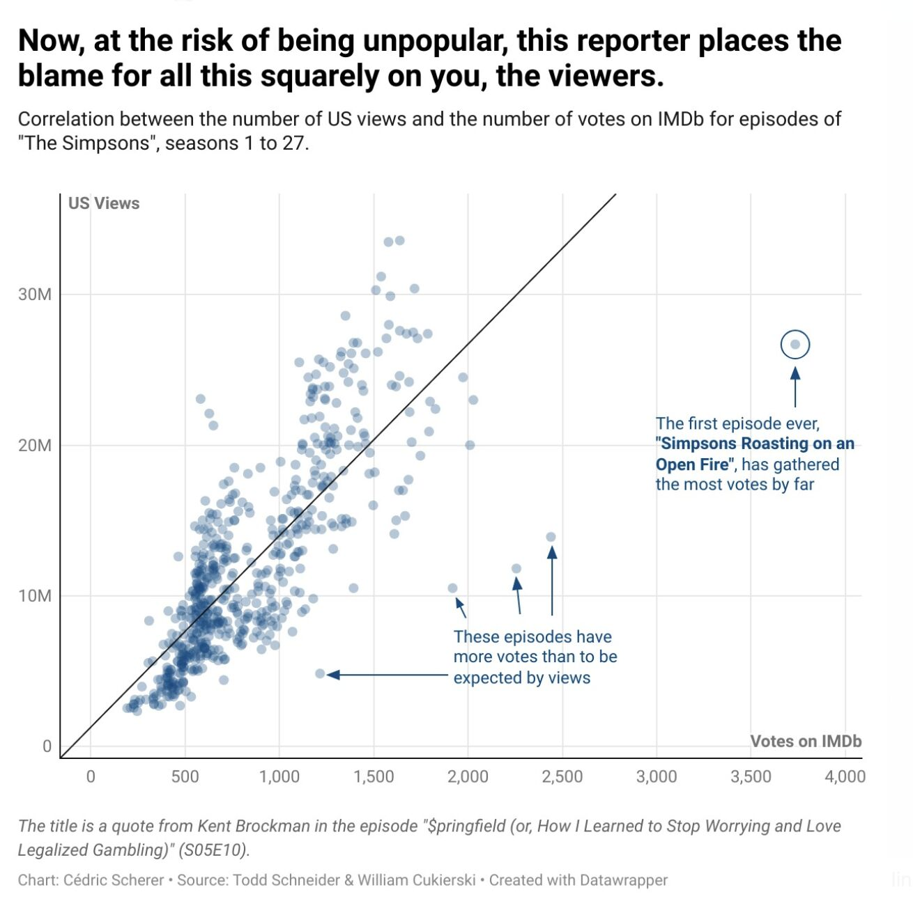
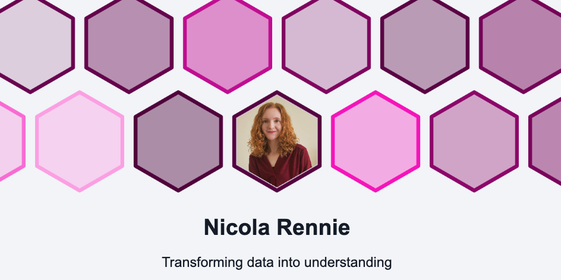
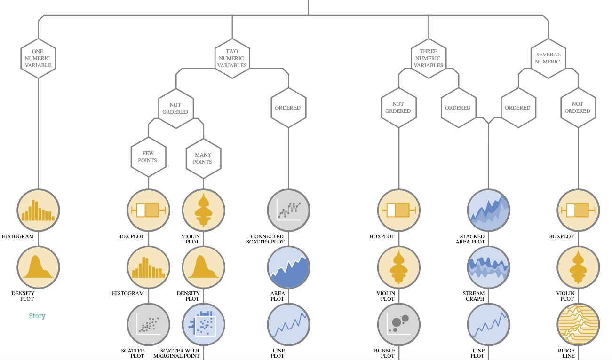
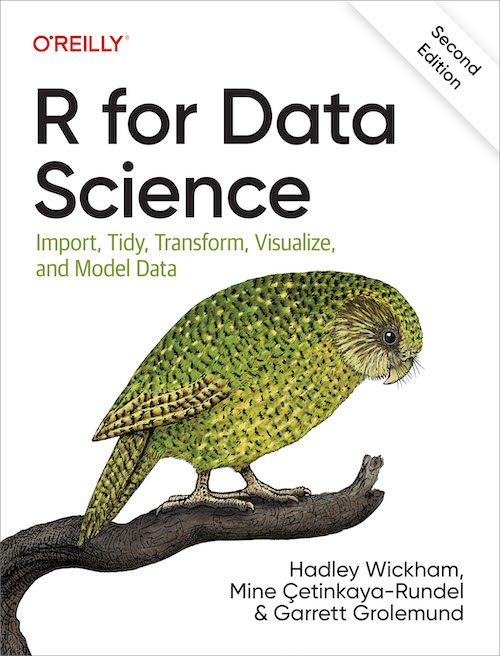

# Exemplar visualisations - how far can we take it?

We've seen how to make 'quick and dirty' plots for ourselves. Now we will give you a glimpse of just how far you can take your visualisations. For this section we are looking at both code complexity and fundamental elements of design. 

The aim of this section is to give you a set of resources that you can use to find examples and inspiration for your own work, as well as starting to look at elements of design. 

Here we will provide guidelines on design and visualisation while highlighting key examples from the scientific community. The good news is that there is an avid visualisation community online - check out the [30 day chart challenge](https://www.linkedin.com/feed/hashtag/?keywords=30daychartchallenge&highlightedUpdateUrns=urn%3Ali%3Aactivity%3A7303019867069136896) or the [datavisualization](https://www.linkedin.com/feed/hashtag/?keywords=datavisualization) hashtag on LinkedIn as a starting point. 

## From the community

These dedicated data scientists create beautiful visualisations and  most of their code is readily available on GitHub for you to learn from too. 

### The gallery of Cédric Scherer

[Cédric Scherer's Data Visualisation Gallery](https://www.cedricscherer.com/top/dataviz/)

When looking through this gallery, note that while some plots are very complex, they are built from basic elements. Each visualisation is carefully designed: colour palettes are interesting but not overwhelming. There is adequate spacing between plot space and titles, axes, and text. Paler text (grey instead of black) makes overall images gentler. Cédric is a master of design as well as code, and all these visualisations demonstrate careful thought and planning. 

This image comes from a 30daychartchallange by Cédric Scherer (Day 20: Correlation), and shows the relationship between the number of US Views and the number of votes on IMDb (a site that hosts voting on tv/movie quality). It looks like US viewers are heavy contributors in the IMDb voting system!

Key things to note about this visualisation: 

- Use of a *lower alpha value* is a functional way to represent density. In addition to the wider scatter plot, there's a clear pattern of higher density which probably contributes heavily to the overall trend line. 

- The *colour scheme is eye-catching* but not abrasive. In design/art this is called a monocolour (a single colour with white or black to modify the colour) - it's highly cohesive and will generally be considered aesthetically pleasing. Note how the text uses the same colour, and the bolded text is also a colour found on the plot itself. The plot is probably using theme_minimal(). 

- There is a *hierarchy of black*, with the title in black, the sub-heading in dark grey, the text below the chart in two separate light greys. This draws the eye to the top and guides the eye downwards. The two axis labels break from this, but only slightly, so that they stand out subtly - you can see them but they don't distract you.  

- *Text on the plot*: this is not too common in scientific journal articles, but is a useful tool for science communication to a wider audience. 

### The gallery of Dr Nicola Rennie

[Dr Nicola Rennie](https://nrennie.rbind.io) is a data visualisation specialist and active community leader (*note*, the link can be used to find a list of Dr Rennie's publications, and some of those offer in-depth run-throughs of visualisation practices). 

Nicola has created a Shiny app to function as a [gallery](https://nrennie.rbind.io/30DayChartChallenge/) for all their 30daychartchallenge entries. Not only is this a stunning gallery with a wide array of chart types and top quality visualisation ideas, but [all of the code is available on github](https://github.com/nrennie/30DayChartChallenge/tree/main) (to navigate to the R code: click on a given year (*e.g.,* 2022), then click on scripts, then open the file for a given plot).

##### EXERCISE 🧠🏋️‍♀️ (BREAKOUT ROOMS; 10 mins)

Take a few minutes to [explore Nicola's gallery](https://nrennie.rbind.io/30DayChartChallenge/) and make some observations about the charts. What do you like? Do you see anything you would do differently? Can you identify a use for one of these charts for visualising your own data? 

::: {.callout-tip collapse="true"}
## Some observations from the gallery 

2024, Day 13 (Family) - very simple plot, the yellow-green is quite an interesting colour. Nice use of highlighting the female boxes in that colour and also having the text box share that colour. Good demonstration of a plot I would have been tempted to make in powerpoint.

2024, Day 1 (Part to Whole) - I love this colour scheme, but it's not easy to tell what the three pink bars represent, and I wonder if this chart would have worked with median income on the Y axis (since we say "higher" income, having income on a vertical axis makes sense).

2024, Day 8 (Circular) - I understand that this colour scheme is picked to fit with the theme of Marvel comics, and I can see how it works with the original "X-MEN" logo, but I personally steer away from these bright yellows and reds, and while I find the yellow on dark blue text has high contrast, I wouldn't describe it as easy to read.

2022, Day 1 (Part to whole) - This yellow on purple has slightly lower contrast but, at least to my eyes, is much nicer and easier to read. 
:::

### #TidyTuesday

Tidy Tuesday is a data science learning community, with weekly social projects where people are invited to create visualisations of a provided dataset. Check out their [GitHub page](https://github.com/rfordatascience/tidytuesday) to learn more and to get involved. 

[Isaac Arrayo gives us a breakdown of four plots from #tidytuesday](https://towardsdatascience.com/explaining-my-favourite-tidytuesday-projects-e44bfe988813), We see four diverse plot types, the rationale for each plot, and how these plots might be applied to a more 'standard' dataset (*i.e.,* an in-real-life example).

::: {.callout-note collapse="true"}
# Why is it called **Tidy** Tuesday?

For the [tidyverse](https://en.wikipedia.org/wiki/Tidyverse) of course! 

:::

## Resources and Showcase

A collection of resources - if you have any recommendations, feel free to [Contact us](https://genomicsaotearoa.github.io/BioinformaticsTrainingProgramme/ContactUs.html) or [open an issue on github](https://github.com/GenomicsAotearoa/visualization_day) and we'll add them here.

### The r-graph-gallery

[The R graph Gallery](https://r-graph-gallery.com/ggplot2-package.html) has a section on ggplot and it highlights some of the exciting features: custom fonts, pre-built themes, interactive plots - there's a lot going on. 

### from Data to Viz

[From Data to Viz](https://www.data-to-viz.com/) is a fantastic resource for thinking about your data and what type of chart might be appropriate. It was developed by Yan Holtz and Conor Healy. 

First, it shows a decision tree for each of the different data types (numeric, categoric *etc.,*). Within the data types you can look at plots for different subcategories (single numeric data, two numeric variables *etc.,*) and there is a "story" article for each subcategory that covers an example and explanations. 

You can also click on a given plot type in the decision tree to open up a panel and view information about the plot type. Each plot also has a dedicated page ([example bubble plot page](https://www.data-to-viz.com/graph/bubble.html)) that gives a full breakdown of the plot, explaining the required variables and some *beautiful* examples. 

If you are interested in more data visualisation stories, we recommend subscribing to the [Dataviz Universe](https://blog.yan-holtz.com/) weekly newsletter by one of the creators Yan Holtz. 

### R for Data Science, 2E

::: {layout-ncol=2}
[{width="100%"}](https://r4ds.hadley.nz/)

The [R for Data Science, 2E](https://r4ds.hadley.nz/) book (available free, online) is the go to resource for anyone learning the tidyverse, and it has a great section on ggplot2! 
It was written Hadley Wickham, Mine Çetinkaya-Rundel, and Garrett Grolemund. [Hadley](https://en.wikipedia.org/wiki/Hadley_Wickham) is a New Zealander and created ggplot2 during his PhD. 

 
:::

## Summary

Elements of design, or the ability to create attention-capturing visuals, is not widely taught (in my experience) in the science sector, but there is a range of useful material and dialogue on visualisation available to you. Remember that everyone will have their own personal preference, and it's important to balance style with clarity. Simplicity is always going to be a powerful factor, and within a single document having a cohesive theme is key. 